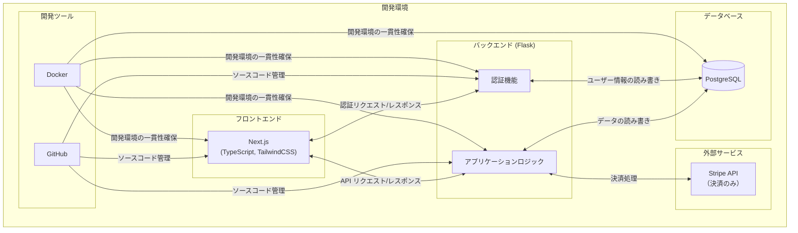

# アーキテクチャ図

この図は、システムの主要なコンポーネントとその関係を示しています。

1. クライアント：ユーザー（一般ユーザーとシニア世代）がブラウザを通じてシステムにアクセスします。
2. フロントエンド：Next.jsを使用して、ユーザーインターフェースを提供します。
3. バックエンド：
 * Pythonを基盤として使用しています。
 * Flaskフレームワークを使用してWebアプリケーションを構築します。
 * 認証機能もPythonとFlaskを使用して実装されています。

4. データベース：PostgreSQLを使用してデータを保存・管理します。
5. 外部サービス：Stripe APIを使用して決済処理を行います。