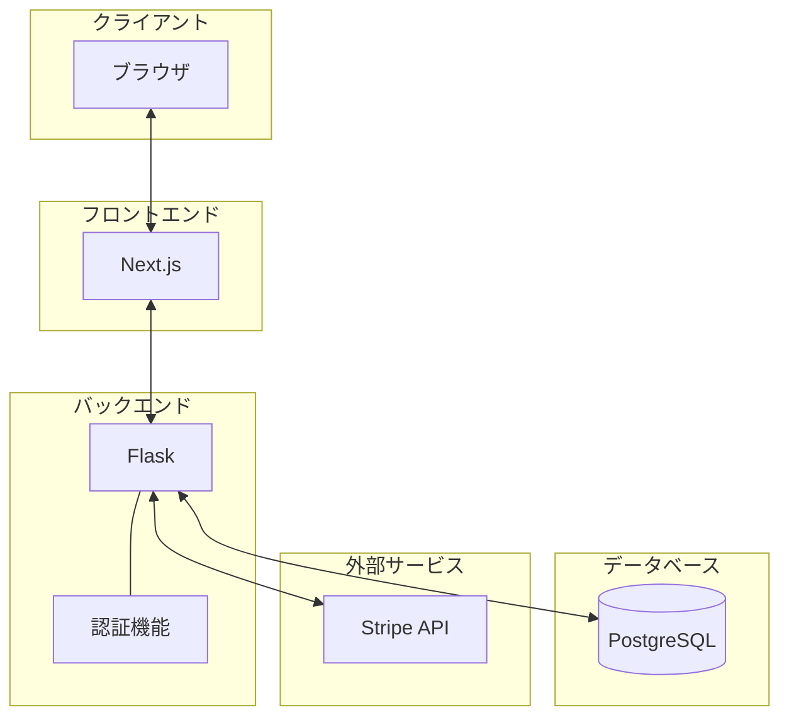

# アーキテクチャ図

この図は、システムの主要なコンポーネントとその関係を示しています。

1. クライアント（ブラウザ）がNext.jsで構築されたフロントエンドと通信します。
2. フロントエンドはFlaskで構築されたバックエンドとAPIを介して通信します。
3. Flaskアプリケーション内に認証機能が実装されています。
4. FlaskはPostgreSQLデータベースとStripe APIと連携します。

Pythonは基盤技術として暗黙的に存在しています。  
図に明示的に表示しないことで、アプリケーションの構造に焦点を当てています。  
