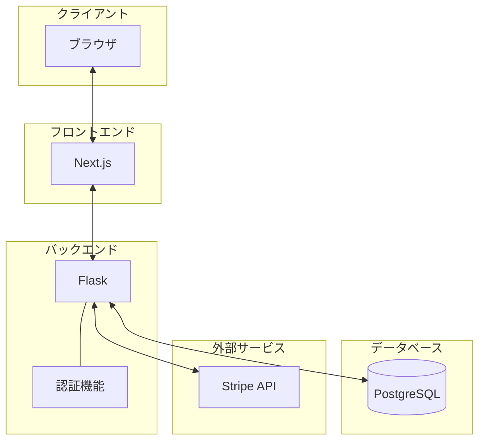

# シーケンス図1(ユーザー：アカウント作成・ログイン・サービス検索・依頼・支払い完了)

このシーケンス図は、以下の主要なステップを示しています.  

1. サイトアクセス：  
ユーザーがサイトにアクセスし、初期ページが表示されます。  

2. アカウント作成：  
ユーザーがアカウント作成をリクエストします。  
入力された情報はFlaskを通じて認証モジュールで検証され、PostgreSQLに保存されます。  
アカウント作成完了がユーザーに通知されます。  

3. ログイン：  
ユーザーがログインをリクエストします。  
認証モジュールがPostgreSQLと連携してユーザー情報を確認します。  
ログイン結果がユーザーに通知されます。  

4. サービス検索：  
ログイン後、ユーザーがサービスを検索します。  
FlaskがPostgreSQLからサービス情報を取得し、結果を返します。  

5. サービス依頼：  
ユーザーが特定のサービスを依頼します。  
依頼情報がPostgreSQLに保存されます。  
Stripe APIを通じて支払い処理が行われます。  
依頼完了がユーザーに通知されます。  

