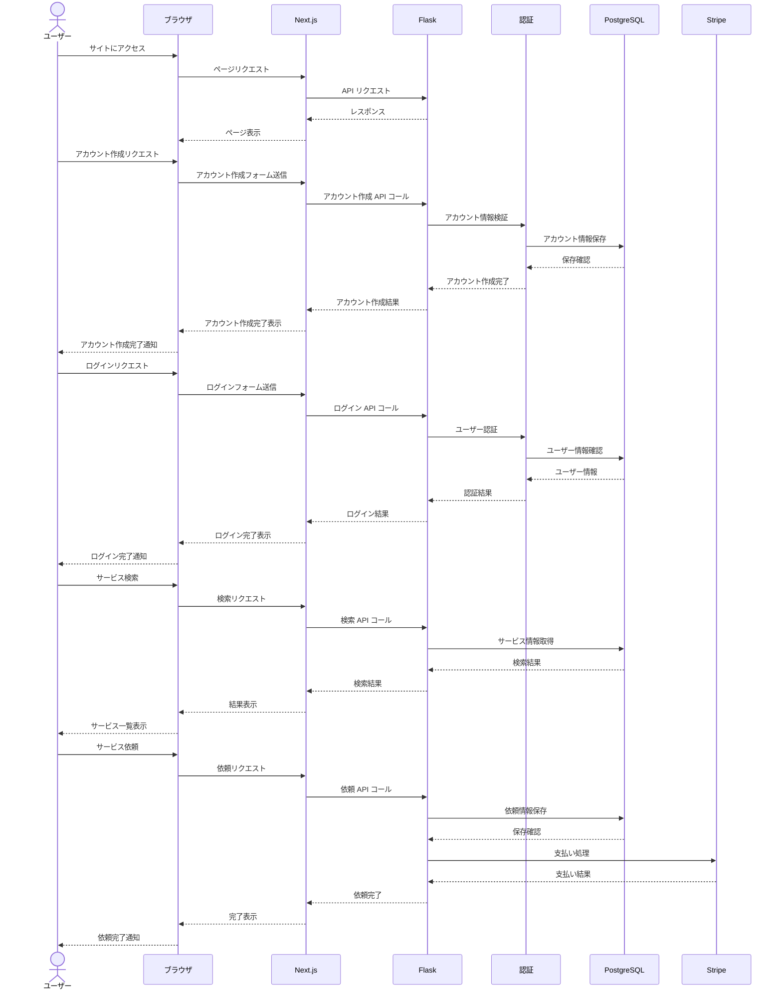

# シーケンス図１(ユーザー)
#### アカウント作成→ログイン→サービス検索→依頼→支払い完了

このシーケンス図は、ユーザーがシニアにサービスを依頼する際の以下のステップを示しています。  

1. サイトアクセス：  
   - ユーザーがサイトにアクセスし、初期ページが表示されます。  

2. アカウント作成：  
   - ユーザーがアカウント作成をリクエストします。  
   - 入力された情報はFlaskを通じて認証モジュールで検証され、PostgreSQLに保存されます。  
   - アカウント作成完了がユーザーに通知されます。  

3. ログイン：  
   - ユーザーがログインをリクエストします。  
   - 認証モジュールがPostgreSQLと連携してユーザー情報を確認します。  
   - ログイン結果がユーザーに通知されます。  

4. サービス検索：  
   - ログイン後、ユーザーがサービスを検索します。  
   - FlaskがPostgreSQLからサービス情報を取得し、結果を返します。  

5. サービス依頼：  
   - ユーザーが特定のサービスを依頼します。  
   - 依頼情報がPostgreSQLに保存されます。  
   - Stripe APIを通じて支払い処理が行われます。  
   - 依頼完了がユーザーに通知されます。  

