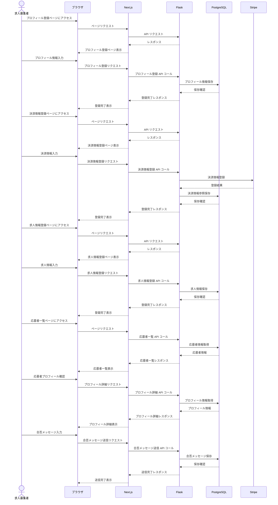

# シーケンス図２(ユーザー)
#### プロフィール登録→決済情報登録→求人情報登録→応募者プロフィール確認→合否メッセージ送信

このシーケンス図は、ユーザーが求人募集する際の以下の流れを示しています。

1. プロフィール登録  
2. 決済情報登録  
3. 求人情報登録  
4. 応募者プロフィール確認  
5. 合否メッセージ送信  

各ステップにおいて、ユーザー（求人募集者）とシステムのコンポーネント（ブラウザ、Next.js、Flask、PostgreSQL、Stripe）間の相互作用を時系列で示しています。
