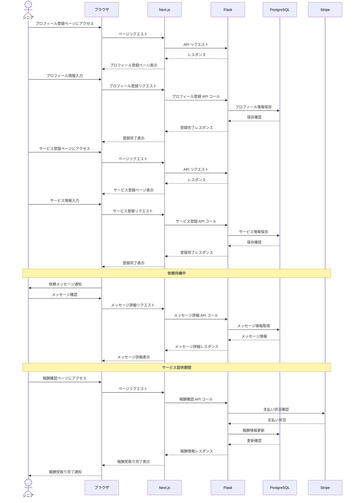

# シーケンス図３(シニア)
#### プロフィール登録→サービス登録→ユーザーからの依頼メッセージ受信→報酬受取り完了

このシーケンス図は、シニアがサービスを提供する際の以下の流れを示しています。

1. プロフィール登録  
2. サービス登録 
3. ユーザーからの依頼メッセージ受信 
4. 報酬受取り完了 

シニアの操作からシステムの各コンポーネント（ブラウザ、Next.js、Flask、PostgreSQL、Stripe）間の相互作用を時系列で示しています。
