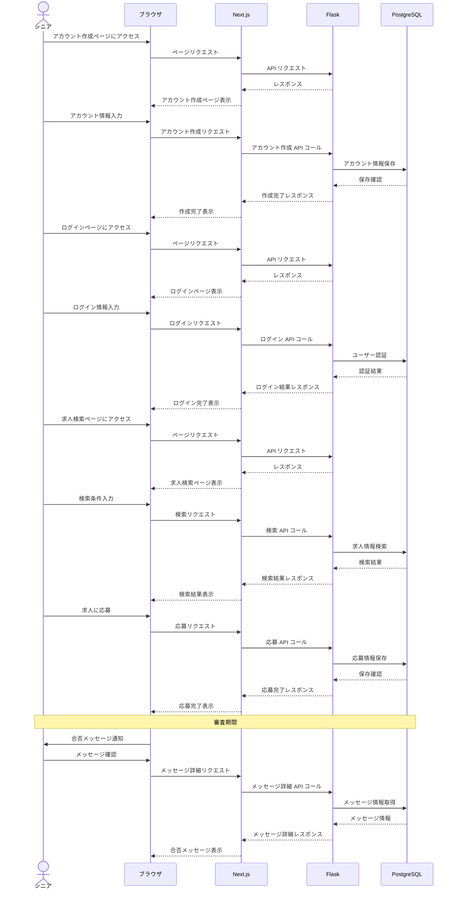

# シーケンス図４(シニア)
#### アカウント作成→ログイン→求人検索→応募→合否メッセージ受信

このシーケンス図は、シニアが求人に応募する際の以下の流れを示しています。

1. アカウント作成  
2. ログイン 
3. 求人検索 
4. 応募  
5. 合否メッセージ受信  

シニアの操作からシステムの各コンポーネント（ブラウザ、Next.js、Flask、PostgreSQL、Stripe）間の相互作用を時系列で示しています。
